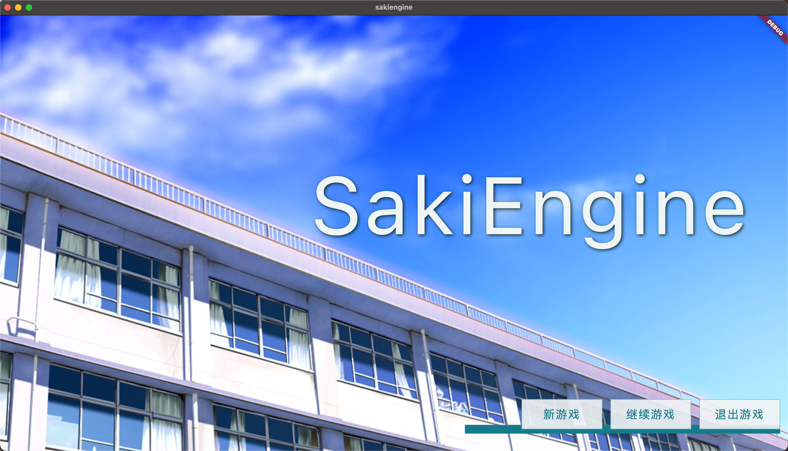
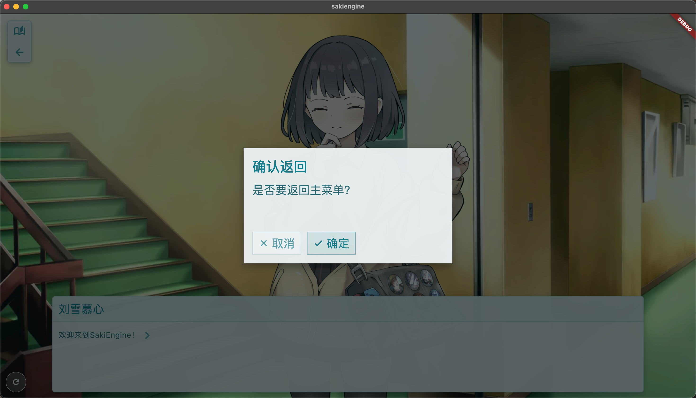
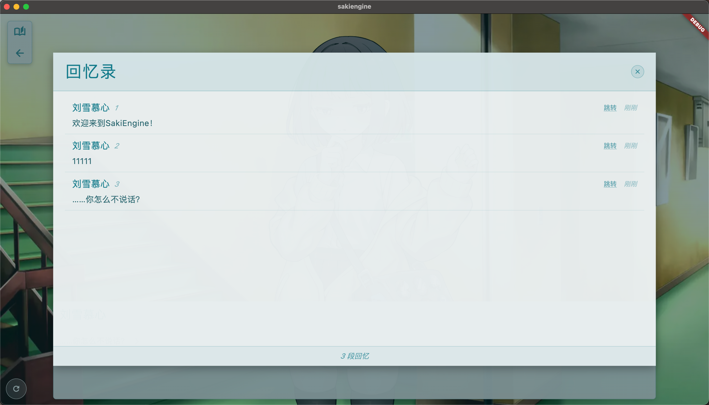
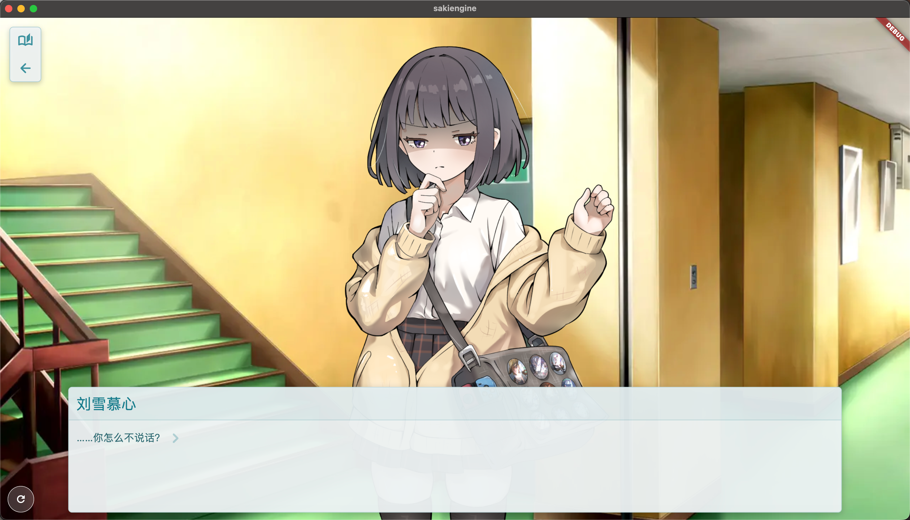

# SakiEngine
## 基于Flutter开发的视觉小说游戏引擎

### 项目截图

#### 主界面


#### 对话系统


#### 历史记录


#### 对话场景


### 项目简介

SakiEngine 是一个基于 Flutter 的现代化视觉小说游戏引擎，专为跨平台游戏开发而设计。

### 主要特性

- **类Renpy语法**：使用类似Renpy的脚本语法，降低游戏开发门槛
- **自适应窗口**：游戏窗口可以自由拉伸，画面智能适配
- **低性能占用**：轻量级引擎，确保流畅的游戏体验
- **强大的UI系统**：丰富的界面控件和交互支持
- **模块化系统**：支持项目特定的自定义模块，实现个性化定制
- **真正的跨平台**：支持多个主流平台
  - Windows
  - Linux
  - macOS
  - Android
  - iOS

### 开发状态

项目目前处于积极开发中。主要功能已经实现，正在持续优化和完善：
- [x] 基础对话系统
- [x] 角色立绘支持
- [x] 场景管理
- [x] 多平台适配
- [x] 对话记录系统
- [x] 回滚系统
- [x] 选择分支系统
- [x] 存档和读档系统
- [x] 项目模块化系统
- [x] 自动项目创建工具
- [x] 音乐、音效和语音系统
- [x] 场景切换效果
- [x] 转场动画
- [x] 脚本内持久化变量设置
- [ ] 更多高级脚本特性
- [ ] 性能进一步优化
- [ ] 更多平台细节适配

### 部署指南

#### 前提条件
- 安装 Flutter SDK（建议使用最新稳定版）
- 配置相应平台的开发环境（Android Studio、Xcode等）

#### 快速开始

##### 开发环境启动（推荐）
```bash
# macOS/Linux
./run.sh

# Windows（使用 Git Bash、WSL 或其他 bash 环境）
./run.sh
```

**首次运行时会自动：**
- 检测您的操作系统（macOS/Linux/Windows）
- 扫描可用的游戏项目
- 让您选择默认游戏项目
- 自动配置并启动项目

##### 传统方式（手动步骤）
1. 选择游戏项目
```bash
./scripts/select_game.sh
```

2. 运行对应平台的传统脚本
```bash
# macOS（传统方式）
./scripts/run_legacy_macos.sh

# 或使用 Flutter 命令（需要先处理资源）
cd Engine
flutter run -d macos --dart-define=SAKI_GAME_PATH="$PWD/../Game/YourGameName"
```

#### 构建发布版

```bash
# 构建不同平台（GitHub Action 使用）
./build.sh macos
./build.sh linux  
./build.sh windows
./build.sh android
./build.sh ios
```

**注意：** 构建前请确保已使用 `./run.sh` 或 `./scripts/select_game.sh` 选择了默认游戏项目。

#### Windows 用户注意事项

Windows 用户需要使用以下方式之一来运行 shell 脚本：

1. **Git Bash**（推荐）
   - 安装 Git for Windows 后自带
   - 右键选择 "Git Bash Here" 然后运行 `./run.sh`

2. **WSL (Windows Subsystem for Linux)**
   - 在 Microsoft Store 安装 Ubuntu 或其他 Linux 发行版
   - 在 WSL 终端中运行脚本

3. **PowerShell + bash**
   - 如果安装了 Git Bash，可在 PowerShell 中运行：`bash ./run.sh`

#### 项目结构

```
SakiEngine/
├── run.sh              # 统一启动脚本（跨平台）
├── build.sh            # 构建脚本（GitHub Action）
├── default_game.txt    # 默认游戏配置文件
├── scripts/            # 工具脚本目录
│   ├── select_game.sh       # 游戏项目选择器
│   ├── create_new_project.sh # 新项目创建工具
│   ├── run_legacy_macos.sh  # 传统macOS启动脚本
│   └── ...                  # 其他工具脚本
├── Engine/             # Flutter引擎主目录
│   ├── lib/           # 引擎源码
│   │   ├── src/       # 引擎核心代码
│   │   ├── projectname/ # 项目特定模块（自动创建）
│   │   └── main.dart  # 主入口
│   ├── tool/          # 开发工具
│   │   └── generate_modules.dart # 模块自动生成器
│   └── pubspec.yaml   # 依赖配置
└── Game/              # 游戏项目目录
    ├── SakiEngine/    # 默认示例游戏
    ├── SoraNoUta/     # 另一个示例项目
    └── YourGame/      # 您的游戏项目（创建工具生成）
```

### 新项目创建

SakiEngine 提供了便捷的项目创建工具，可以快速搭建新的视觉小说项目：

#### 创建新项目

```bash
./scripts/create_new_project.sh
```

**创建工具会自动：**
- 创建完整的项目目录结构
- 生成基础的配置文件（角色、姿势、系统配置）
- 创建示例剧情脚本
- **自动生成项目专用的Flutter模块**
- 配置主题颜色和Bundle ID
- 更新模块注册表

#### 项目模块化系统

每个新项目都会自动创建对应的Flutter模块，支持：
- **自定义主题**：项目特有的颜色、字体、界面风格
- **自定义界面**：主菜单、游戏界面、存档界面等
- **项目配置**：特殊的引擎参数和功能开关
- **智能回退**：未自定义的组件自动使用引擎默认实现

项目模块位置：`Engine/lib/项目名小写/项目名_module.dart`

#### 快速开始新项目

1. **创建项目**
```bash
./scripts/create_new_project.sh
```

2. **选择并运行**
```bash
./run.sh  # 选择新创建的项目
```

3. **自定义项目模块**
```bash
# 编辑项目模块文件
Engine/lib/yourproject/yourproject_module.dart
```

### VSCode 语法高亮插件

项目根目录包含一个专门为 SakiEngine 开发的 VSCode 语法高亮插件 `vscode-sakiengine-syntax`，支持以下文件类型的语法高亮：

- `.sks` - 剧本文件 (Script Files)
- `.sks` - 配置文件 (Configuration Files)
- `.sks` - 坐标管理文件 (Position Management Files)
- `.sks` - 角色定义文件 (Character Definition Files)

#### 安装方法

1. 在 VSCode 中打开扩展视图
2. 选择 "从 VSIX 安装"
3. 导航到项目根目录下的 `vscode-sakiengine-syntax` 文件夹
4. 选择最新版本的 `.vsix` 文件进行安装

通过这个插件，你可以获得更好的代码编辑体验，包括语法高亮、代码着色等功能，让脚本编写更加直观和高效。

### 脚本语法示例

SakiEngine 使用 `.sks` 脚本文件，语法简单直观，类似 Renpy，但更加简洁：

```sks
// 开始标签
label start
// 设置背景场景
scene bg school 

// 角色对话（角色标识 姿势 表情 对话）
yk pose2 happy "欢迎来到SakiEngine！"

// 选择菜单
menu
"给她巧克力" choice_chocolate
"保持沉默" choice_silence
"表情测试" choice_expressions
endmenu

// 巧克力选项
label choice_chocolate
yk "呀，谢谢！"
"嘿嘿，喜欢吗？"
yk happy "当然喜欢！"
return

// 沉默选项
label choice_silence
yk sad "你怎么不说话？"
yk "不理你了。"
return

// 表情变化
label choice_expressions
yk pose1 "这是不同的姿势和表情"
yk happy "开心的表情"
yk sad "难过的表情"
return
```

特点：
- 无需缩进
- 使用 `//` 注释
- 简单的角色对话语法
- 灵活的场景和表情切换
- 直观的选择菜单系统

### 许可证

本项目使用开源许可证。详细信息请参见 LICENSE 文件。

### 贡献

欢迎提交 Issues 和 Pull Requests！
